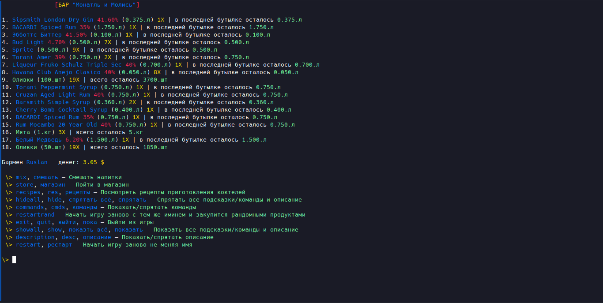

# Simulator barman "Foobarman" (cli-game)

  

## Description

Welcome, this repo with cli-game that show what its like to be a bartender  
and maybe even teach you somthing else.

All control on the command line - hints are present.

Look, if you want playing this game,  
You need to download and run the file corresponding to your operating system  
> Most likely it is foobarman-amd64-windows.exe for Windows or foobarman-amd64-linux for Linux)

First thing you need to do its select name for your bartender.  
Second thing its shoping in the store, choose the right ingredients, you only have three hundred bucks.  
And now the real game begins... 

### Screenshots

  

  

  

> TODO later there will be more screenshots and more detailed instructions for the game.

## References

Most of the information is taken from open sources. In particular from the sites:
- https://ru.inshaker.com (most cocktail recipes, their description and description of drinks)
- https://drizly.com (Most drinks, their prices and thier descriptions)

## PS 

The source code is closed so as not to spoil the impression of the game,   
since there are many non-typical situations,  
knowing which in advance you will not get such pleasure from the game  

## Technical information

Game version: 0.3.2  
Main development language: Go (Golang)  
Golang version: 1.19  

Used external golang libraries (from go.mod):
- github.com/chzyer/readline v0.0.0-20180603132655-2972be24d48e 
- golang.org/x/sys v0.0.0-20181122145206-62eef0e2fa9b
- github.com/chzyer/readline v0.0.0-20180603132655-2972be24d48e
- golang.org/x/sys v0.0.0-20181122145206-62eef0e2fa9b

## Copyright
   
  Copyright (C) 2023 Ruslan (devllartone@gmail.com)  
  Cli-Game "Foobarman" is free to play.  
